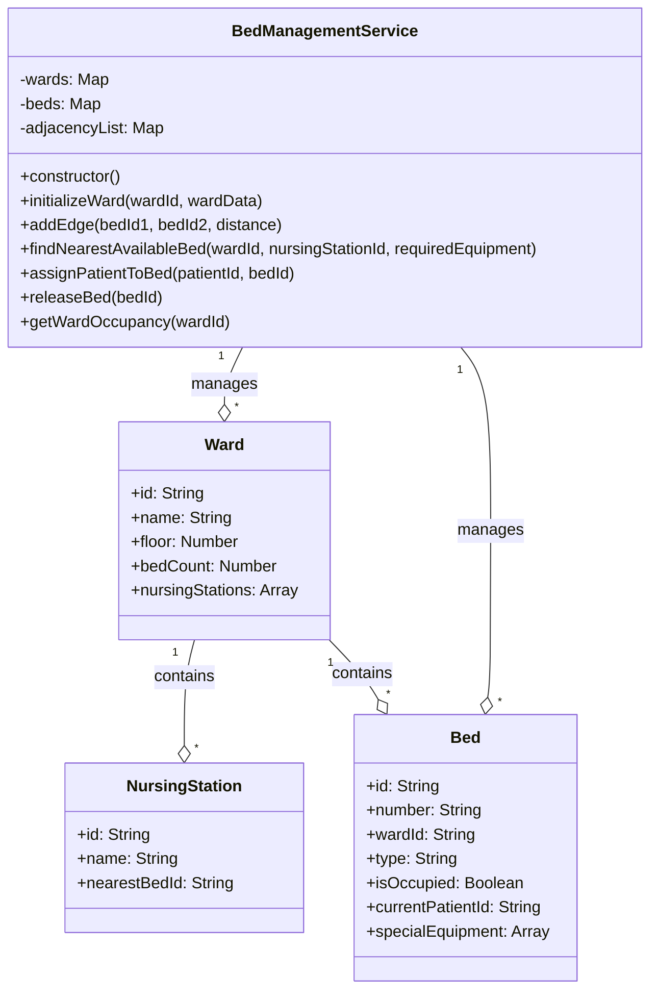

# Bed Management System UML Diagram

This UML diagram illustrates the implementation of **Graph Theory** in the Bed Management System of the Hospital Management System.

## Components

### BedManagementService Class
Implements the bed management system using graph algorithms to optimize bed assignments based on proximity to nursing stations and specialized equipment.

### Ward Class
Represents a hospital ward with beds and nursing stations.

### Bed Class
Represents an individual hospital bed with its properties and equipment.

### NursingStation Class
Represents a nursing station within a ward.

## Relationships

- BedManagementService manages multiple Wards and Beds.
- Each Ward contains multiple NursingStations and Beds.

## Graph Implementation Details

- The ward layout is represented as an undirected graph using an adjacency list.
- Beds are nodes in the graph, and edges represent adjacency between beds.
- Breadth-First Search (BFS) algorithm is used to find the nearest available bed to a nursing station.
- The graph structure enables efficient path finding and distance calculation between different locations in the ward.
