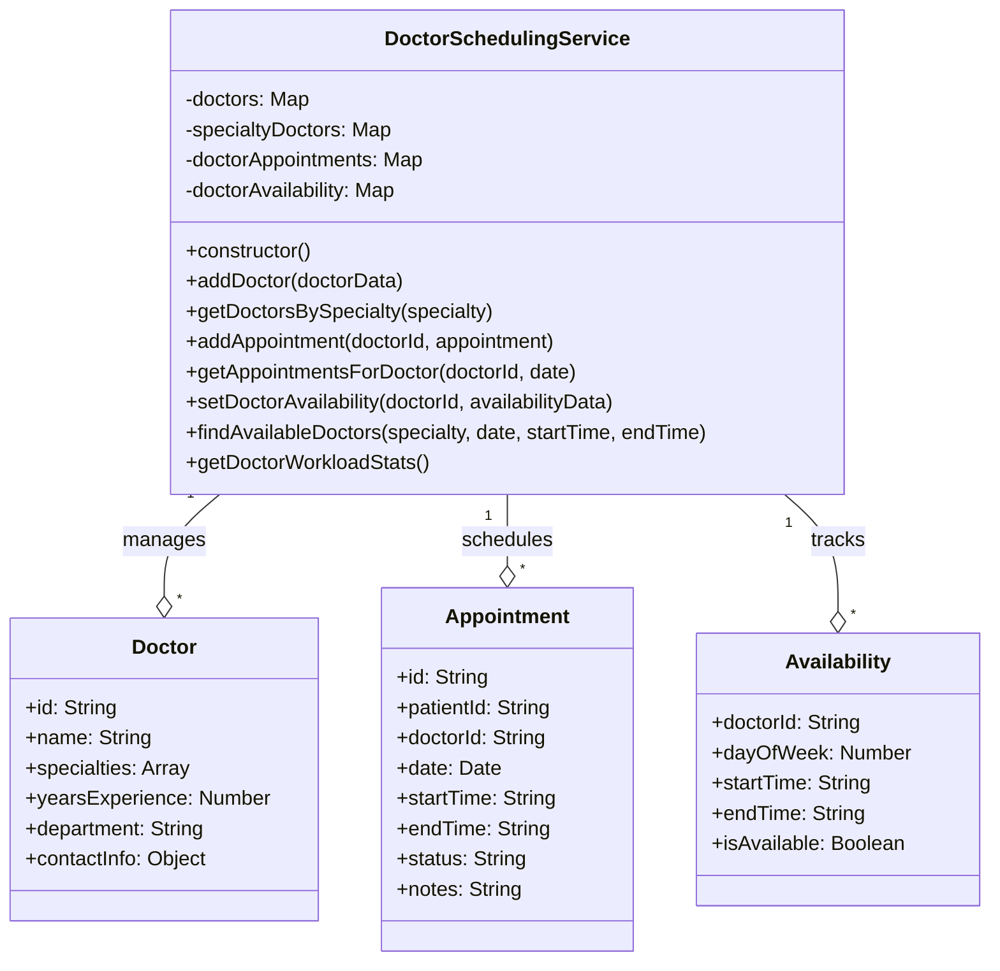

# Doctor Scheduling Service UML Diagram

This UML diagram illustrates the implementation of **Hash Maps/Tables** in the Doctor Scheduling Service of the Hospital Management System.

## Components

### DoctorSchedulingService Class
Implements doctor scheduling using multiple hash maps for efficient lookups and operations.

### Doctor Class
Represents a doctor with their medical specialties and contact information.

### Appointment Class
Represents a scheduled appointment between a doctor and a patient.

### Availability Class
Represents a doctor's availability during a specific time slot.

## Relationships

- DoctorSchedulingService manages Doctors, Appointments, and Availability records.

## Hash Map Implementation Details

- Multiple hash maps provide O(1) time complexity for key-based lookups:
  - doctors: Maps doctorId to doctor data
  - specialtyDoctors: Maps specialty to set of doctorIds
  - doctorAppointments: Maps doctorId to map of days to appointments
  - doctorAvailability: Maps doctorId to availability schedule

- This structure enables efficient queries like:
  - Finding doctors by specialty
  - Checking a doctor's schedule for a specific day
  - Finding available doctors for a given time slot
