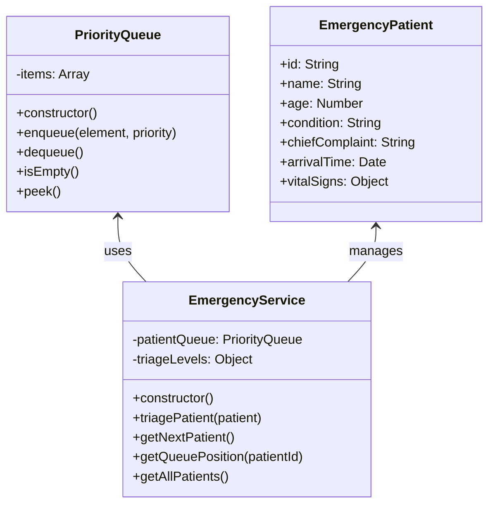

# Emergency Priority Queue UML Diagram

This UML diagram illustrates the implementation of the **Priority Queue** data structure in the Emergency module of the Hospital Management System.

## Components

### PriorityQueue Class
A custom priority queue implementation that ensures patients with higher priority (more critical conditions) are treated first.

### EmergencyService Class
Manages emergency patients using the priority queue for proper triage based on severity, age, and other factors.

### EmergencyPatient Class
Represents a patient in the emergency department with relevant medical information.

## Relationships

- EmergencyService uses PriorityQueue to manage patients based on their severity.
- EmergencyService processes and manages EmergencyPatient objects.

## Implementation Details

- The priority queue sorts patients by condition severity (critical, severe, moderate, mild, stable).
- Age modifiers give higher priority to children and elderly patients.
- The implementation ensures O(n) time complexity for enqueue and O(1) for dequeue operations.
