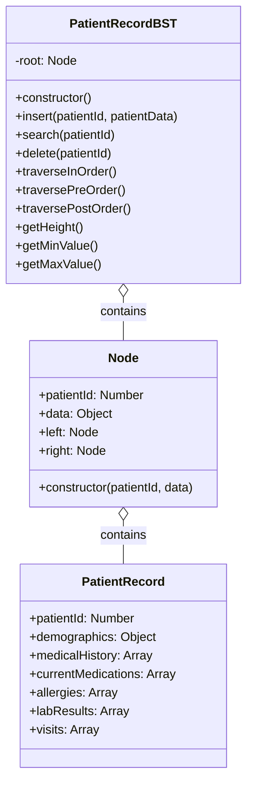

# Patient Record BST UML Diagram

This UML diagram illustrates the implementation of the **Binary Search Tree (BST)** data structure used for managing patient records in the Hospital Management System.

## Components

### PatientRecordBST Class
Implements a Binary Search Tree for efficient storage and retrieval of patient records based on patient ID.

### Node Class
Represents a node in the Binary Search Tree containing patient data and references to left and right child nodes.

### PatientRecord Class
Stores comprehensive patient information including demographics, medical history, medications, and visits.

## Relationships

- PatientRecordBST contains multiple Node objects in a tree structure.
- Each Node contains a PatientRecord object.

## Implementation Details

- Patient records are sorted by patient ID in the BST.
- The BST provides efficient O(log n) time complexity for search, insert, and delete operations.
- Various traversal methods (in-order, pre-order, post-order) support different data access patterns.
- The BST structure enables range queries like finding patients within a specific ID range.
