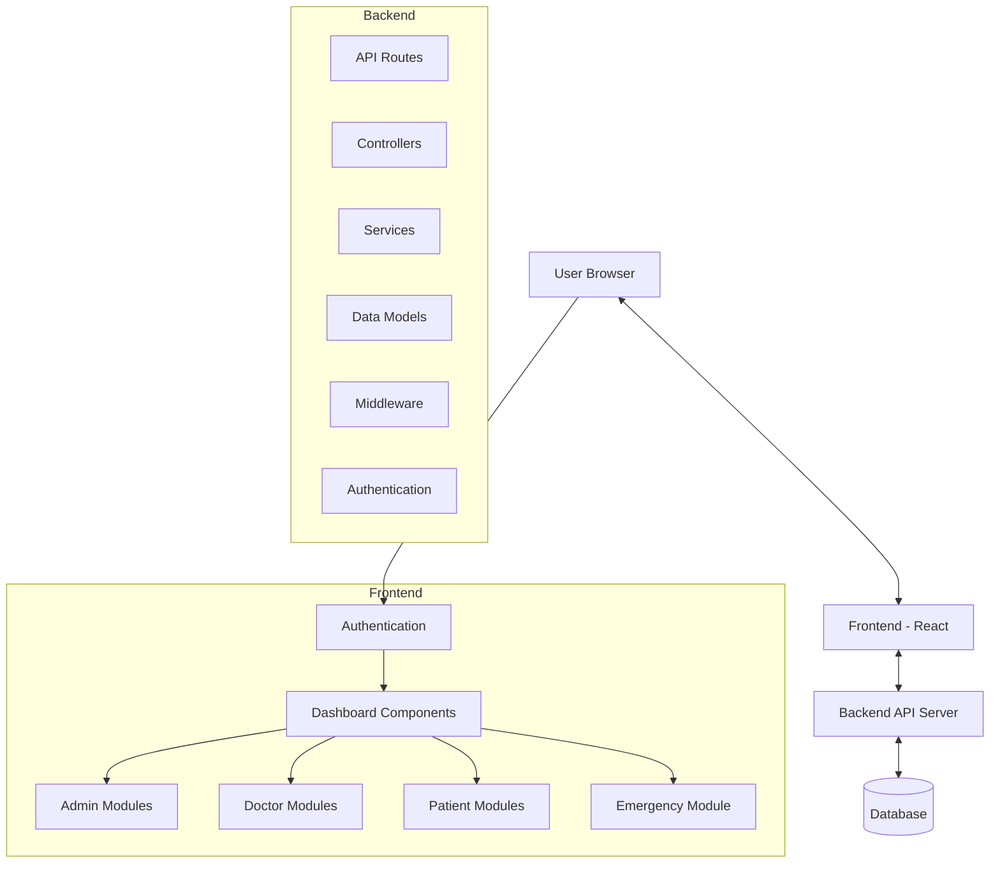
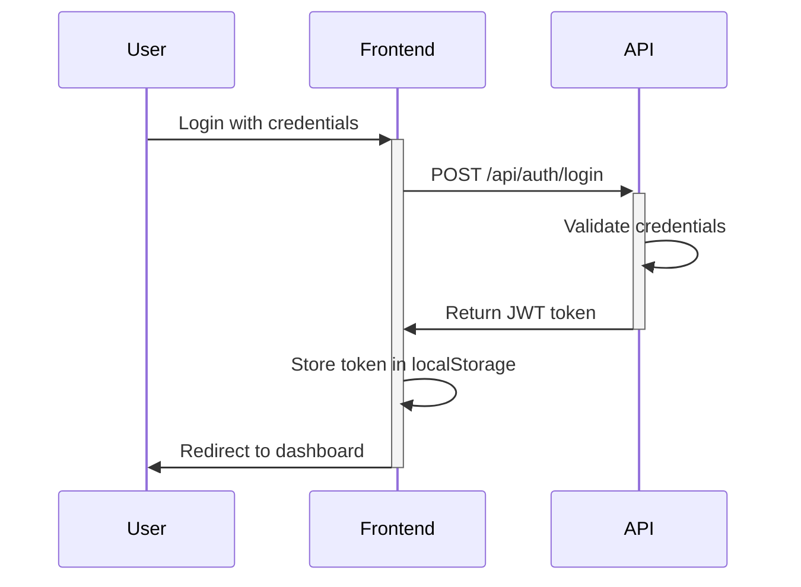
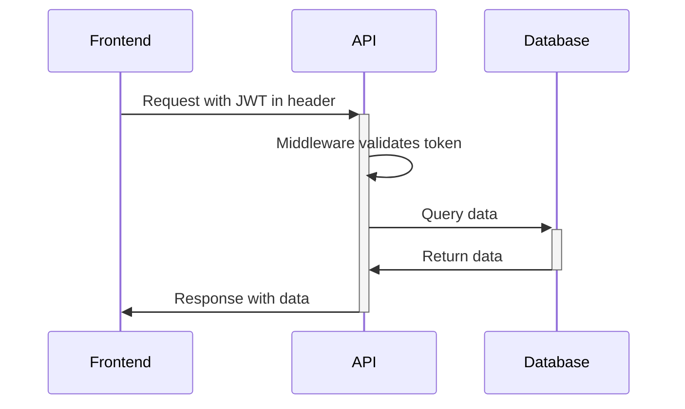

# Hospital Management System - Architecture & Data Flow

## System Overview

The Hospital Management System (HMS) is a comprehensive web application built with React on the frontend and a RESTful API backend. It facilitates various hospital operations including patient management, doctor scheduling, appointment booking, bed management, and emergency services.

## Architecture



## Technology Stack

- **Frontend**: React, Material-UI, React Router
- **Backend**: Node.js, Express.js
- **Database**: MongoDB
- **Authentication**: JWT (JSON Web Tokens)
- **State Management**: React Context API

## Data Flow

### Authentication Flow



### API Request Flow



## Core Services

### 1. AuthService

**Responsible for**: User authentication, registration, and authorization.

```javascript
// Sample usage
const user = await AuthService.login(email, password);
// Returns user object with token
```

**API Endpoints**:
- `POST /api/auth/login`: Authenticate user and return token
- `POST /api/auth/register`: Register new user
- `GET /api/auth/profile`: Get current user profile
- `POST /api/auth/logout`: Logout user

**JSON Structure**:
```json
// User Object
{
  "id": "user123",
  "name": "John Doe",
  "email": "john.doe@example.com",
  "role": "doctor",
  "token": "jwt.token.here",
  "department": "Cardiology"
}
```

### 2. AppointmentService

**Responsible for**: Managing patient appointments, scheduling, and notifications.

```javascript
// Sample usage
const appointments = await AppointmentService.getAllAppointments();
const newAppointment = await AppointmentService.createAppointment(appointmentData);
```

**API Endpoints**:
- `GET /api/appointments`: Get all appointments
- `GET /api/appointments/:id`: Get specific appointment
- `POST /api/appointments`: Create new appointment
- `PUT /api/appointments/:id`: Update appointment
- `DELETE /api/appointments/:id`: Cancel appointment

**JSON Structure**:
```json
// Appointment Object
{
  "id": "appt123",
  "patientId": "patient456",
  "doctorId": "doctor789",
  "date": "2025-04-20T09:30:00.000Z",
  "status": "scheduled",
  "notes": "Follow-up appointment",
  "department": "Cardiology",
  "duration": 30
}
```

### 3. EmergencyService

**Responsible for**: Managing emergency department including patient triage, bed assignments, and real-time stats.

```javascript
// Sample usage
const stats = EmergencyService.getEmergencyStats();
const triageResult = EmergencyService.triagePatient(patientData);
```

**API Endpoints**:
- `GET /api/emergency/patients`: Get all emergency patients
- `GET /api/emergency/stats`: Get emergency department stats
- `POST /api/emergency/patients`: Add new emergency patient
- `PUT /api/emergency/patients/:id/triage`: Update patient triage status

**JSON Structure**:
```json
// Emergency Patient Object
{
  "id": "EP001",
  "name": "Jane Smith",
  "age": 45,
  "condition": "critical",
  "chiefComplaint": "Chest pain and shortness of breath",
  "arrivalTime": "2025-04-15T00:30:00.000Z",
  "vitalSigns": {
    "bloodPressure": "160/95",
    "heartRate": 110,
    "respiratoryRate": 24,
    "temperature": 37.8,
    "oxygenSaturation": 92
  },
  "triageLevel": 1,
  "assignedDoctorId": "doctor123",
  "assignedBedId": "bed456"
}
```

### 4. BedManagementService

**Responsible for**: Managing hospital beds, wards, and room assignments.

```javascript
// Sample usage
const wardOccupancy = BedManagementService.getWardOccupancy('WARD001');
const bed = BedManagementService.assignPatientToBed('patient123', 'BED101');
```

**API Endpoints**:
- `GET /api/beds`: Get all beds
- `GET /api/beds/:id`: Get specific bed details
- `GET /api/wards`: Get all wards
- `GET /api/wards/:id/occupancy`: Get ward occupancy statistics
- `PUT /api/beds/:id/assign`: Assign patient to bed
- `PUT /api/beds/:id/release`: Release bed

**JSON Structure**:
```json
// Bed Object
{
  "id": "BED101",
  "number": "101",
  "wardId": "WARD001",
  "type": "cardiac",
  "isOccupied": true,
  "currentPatientId": "patient123",
  "specialEquipment": ["ecg_monitor", "oxygen"]
}

// Ward Object
{
  "id": "WARD001",
  "name": "Cardiac Care Unit",
  "floor": 3,
  "bedCount": 20,
  "occupiedBeds": 15,
  "occupancyRate": 75
}
```

### 5. PatientService

**Responsible for**: Managing patient records, medical history, and demographic information.

```javascript
// Sample usage
const patient = await PatientService.getPatientById('patient123');
const medicalHistory = await PatientService.getPatientMedicalHistory('patient123');
```

**API Endpoints**:
- `GET /api/patients`: Get all patients
- `GET /api/patients/:id`: Get patient details
- `POST /api/patients`: Create new patient
- `PUT /api/patients/:id`: Update patient information
- `GET /api/patients/:id/medical-history`: Get patient medical history
- `POST /api/patients/:id/medical-history`: Add medical history entry

**JSON Structure**:
```json
// Patient Object
{
  "id": "patient123",
  "demographics": {
    "name": "Linda Wilson",
    "age": 55,
    "gender": "female",
    "contact": "555-1234",
    "address": "123 Main St",
    "emergencyContact": "John Wilson (Husband): 555-5678"
  },
  "medicalHistory": [
    {
      "id": "mh001",
      "date": "2025-02-10T09:30:00.000Z",
      "condition": "Hypertension",
      "notes": "Diagnosed with stage 1 hypertension",
      "doctorId": "doctor789"
    }
  ],
  "currentMedications": [
    {
      "id": "med001",
      "name": "Lisinopril",
      "dosage": "10mg",
      "frequency": "Once daily",
      "startDate": "2025-02-10T00:00:00.000Z"
    }
  ],
  "allergies": ["Penicillin", "Sulfa drugs"],
  "insuranceInfo": {
    "provider": "BlueShield",
    "policyNumber": "BS12345678",
    "coverageDetails": "Full coverage with $20 copay"
  }
}
```

## Backend Architecture

### Server Configuration

The HMS backend is built on Node.js with Express.js framework, configured to handle various API requests securely and efficiently.

```javascript
// Sample server setup (server.js)
const express = require('express');
const cors = require('cors');
const mongoose = require('mongoose');
const bodyParser = require('body-parser');
const authRoutes = require('./routes/authRoutes');
const patientRoutes = require('./routes/patientRoutes');
const appointmentRoutes = require('./routes/appointmentRoutes');
const emergencyRoutes = require('./routes/emergencyRoutes');
const bedRoutes = require('./routes/bedRoutes');

const app = express();

// Middleware configuration
app.use(cors());
app.use(bodyParser.json());
app.use(bodyParser.urlencoded({ extended: true }));

// Attach routes
app.use('/api/auth', authRoutes);
app.use('/api/patients', patientRoutes);
app.use('/api/appointments', appointmentRoutes);
app.use('/api/emergency', emergencyRoutes);
app.use('/api/beds', bedRoutes);

// Database connection
mongoose.connect('mongodb://localhost:27017/hms', {
  useNewUrlParser: true,
  useUnifiedTopology: true
});

// Error handling middleware
app.use((err, req, res, next) => {
  console.error(err.stack);
  res.status(500).send('Something broke!');
});

const PORT = process.env.PORT || 5000;
app.listen(PORT, () => {
  console.log(`Server running on port ${PORT}`);
});
```

### Router Structure

Each module has dedicated routers to handle specific functionalities:

```javascript
// Sample router (appointmentRoutes.js)
const express = require('express');
const router = express.Router();
const appointmentController = require('../controllers/appointmentController');
const authMiddleware = require('../middleware/authMiddleware');
const roleMiddleware = require('../middleware/roleMiddleware');

// Get all appointments (accessible by admins and doctors)
router.get('/', 
  authMiddleware.verifyToken, 
  roleMiddleware.restrictTo('admin', 'doctor'),
  appointmentController.getAllAppointments
);

// Get appointments for a specific patient
router.get('/patient/:patientId',
  authMiddleware.verifyToken,
  appointmentController.getPatientAppointments
);

// Create new appointment
router.post('/',
  authMiddleware.verifyToken,
  appointmentController.createAppointment
);

// Update appointment
router.put('/:id',
  authMiddleware.verifyToken,
  appointmentController.updateAppointment
);

// Cancel appointment
router.delete('/:id',
  authMiddleware.verifyToken,
  appointmentController.cancelAppointment
);

module.exports = router;
```

### Middleware Implementation

The system uses several middleware layers for security, validation, and request processing:

```javascript
// Authentication Middleware (authMiddleware.js)
const jwt = require('jsonwebtoken');
const User = require('../models/User');

exports.verifyToken = async (req, res, next) => {
  try {
    // Get token from header
    const token = req.headers.authorization?.split(' ')[1];
    
    if (!token) {
      return res.status(401).json({ message: 'No token, authorization denied' });
    }
    
    // Verify token
    const decoded = jwt.verify(token, process.env.JWT_SECRET);
    
    // Add user from payload
    const user = await User.findById(decoded.id).select('-password');
    if (!user) {
      return res.status(401).json({ message: 'Token is not valid' });
    }
    
    req.user = user;
    next();
  } catch (error) {
    res.status(401).json({ message: 'Token is not valid' });
  }
};

// Role-based Access Control Middleware (roleMiddleware.js)
exports.restrictTo = (...roles) => {
  return (req, res, next) => {
    if (!roles.includes(req.user.role)) {
      return res.status(403).json({
        message: 'You do not have permission to perform this action'
      });
    }
    next();
  };
};

// Request Validation Middleware (validationMiddleware.js)
const { validationResult } = require('express-validator');

exports.validateRequest = (req, res, next) => {
  const errors = validationResult(req);
  if (!errors.isEmpty()) {
    return res.status(400).json({ errors: errors.array() });
  }
  next();
};

// Logging Middleware (loggingMiddleware.js)
exports.logRequests = (req, res, next) => {
  console.log(`${new Date().toISOString()} - ${req.method} ${req.originalUrl}`);
  next();
};

// Error Handling Middleware (errorMiddleware.js)
exports.errorHandler = (err, req, res, next) => {
  const statusCode = err.statusCode || 500;
  res.status(statusCode).json({
    status: 'error',
    statusCode,
    message: err.message,
    stack: process.env.NODE_ENV === 'development' ? err.stack : undefined
  });
};
```

## System Components & Key Features

### Admin Dashboard
- Hospital statistics
- Staff management
- Department performance metrics
- System configuration

### Doctor Portal
- Patient appointments view
- Medical records access
- Schedule management
- Prescription generation

### Patient Portal
- Appointment booking
- Medical history view
- Prescription access
- Test results view

### Emergency Department
- Real-time patient tracking
- Triage management with priority queue
- Bed availability monitoring
- Staff assignment

### Bed Management
- Ward and bed visualization
- Patient assignment
- Cleaning status tracking
- Equipment tracking

## Data Storage

The system uses MongoDB for data storage with the following collections:

- **users**: User accounts and authentication data
- **patients**: Patient demographics and basic info
- **medical_records**: Patient medical history, linked to patients
- **appointments**: Scheduled appointments
- **doctors**: Doctor profiles and specialties
- **wards**: Hospital wards information
- **beds**: Individual bed data
- **emergency_cases**: Emergency department patients

## Security Features

- JWT-based authentication
- Role-based access control (RBAC)
- Password hashing and salting
- HTTPS data transmission
- API request validation
- Logging and audit trails

## Development Environment

### Frontend Setup
```bash
# Install dependencies
npm install

# Start development server
npm start
```

### Backend Setup
```bash
# Install dependencies
cd backend
npm install

# Start development server
npm run dev
```

## Production Deployment

The application is deployed using the following process:

1. Frontend build: `npm run build`
2. Backend build: `npm run build` in the backend directory
3. Deploy frontend to static hosting service
4. Deploy backend to Node.js hosting service
5. Configure environment variables for production
