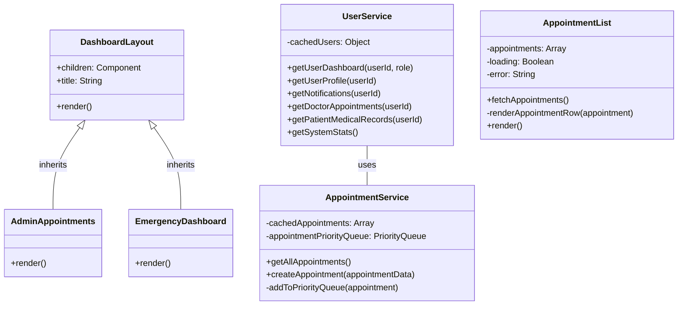

# OOP Concepts UML Diagram

This UML diagram illustrates the four key Object-Oriented Programming (OOP) concepts implemented in the Hospital Management System.

## 1. Encapsulation

**AppointmentService Class:**
- Bundles data (cachedAppointments, appointmentPriorityQueue) with methods that operate on that data
- Uses private methods (-addToPriorityQueue) to hide implementation details
- Provides a clean public API while protecting internal state

## 2. Inheritance

**DashboardLayout and Child Components:**
- DashboardLayout serves as a parent class providing common structure and functionality
- AdminAppointments and EmergencyDashboard inherit from DashboardLayout
- Child components specialize the layout for specific use cases while inheriting common behavior

## 3. Polymorphism

**UserService Class:**
- Implements polymorphic behavior through its getUserDashboard method
- Different user roles (doctor, patient, admin) get different dashboard data
- The method signature stays the same, but behavior varies based on role parameter
- This allows the system to treat different user types through a unified interface

## 4. Abstraction

**AppointmentList Class:**
- Abstracts the complexity of data fetching, processing, and rendering
- Exposes only the necessary functionality (fetchAppointments) to users of this component
- Hides implementation details like error handling and rendering logic
- Simplifies usage and makes the component easier to maintain
